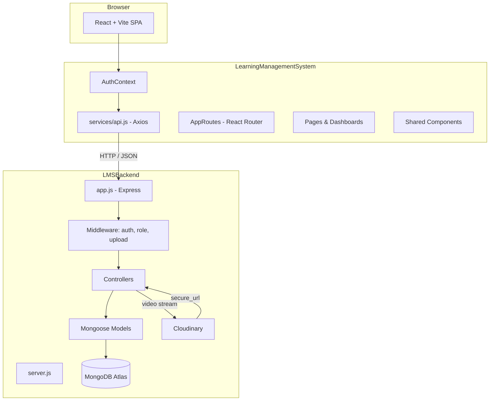
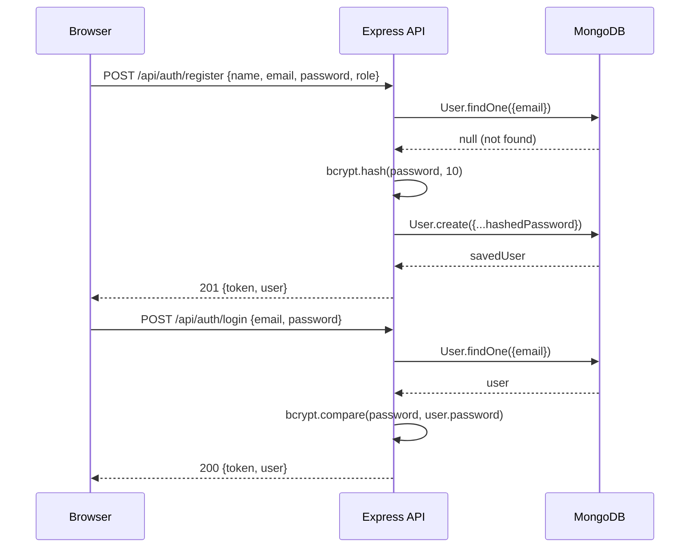
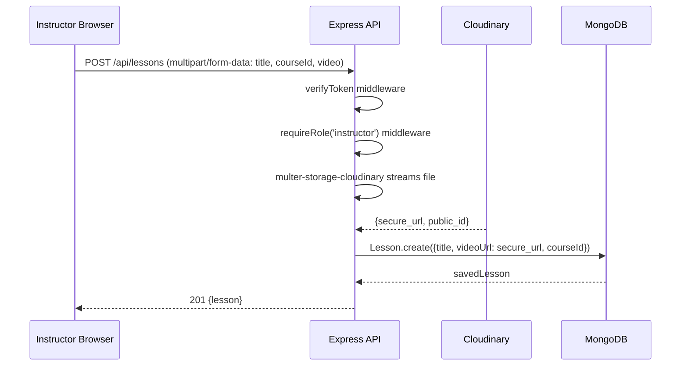
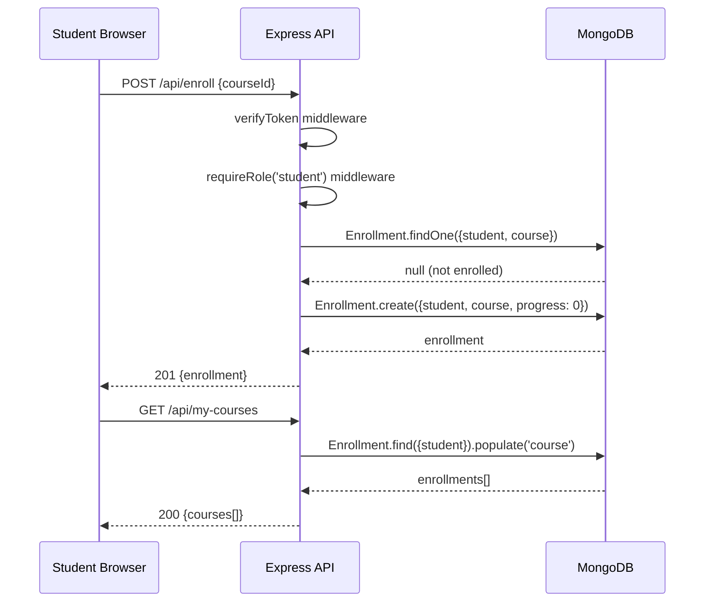

# Design Document: MERN Stack Learning Management System (LMS)

## Overview

A full-featured Learning Management System built on the MERN stack (MongoDB, Express.js, React, Node.js) that supports three distinct user roles — Admin, Instructor, and Student — each with their own dashboard and capabilities. The system handles user authentication via JWT, course and lesson management with Cloudinary-hosted video uploads, and student enrollment tracking, all served through a RESTful API consumed by a React + Bootstrap frontend.

The project extends an existing starter structure: the backend lives in `LMSBackend/` (Express + Mongoose, CommonJS modules) and the frontend in `LearningManagementSystem/` (React 19 + Vite, ESM). Several public pages and the Axios API client already exist; this design covers everything that needs to be built on top of that foundation.

The marking criteria weight backend API development (20), database design (15), authentication & security (15), and React implementation (15) most heavily, so the design prioritises clean separation of concerns, robust JWT/role middleware, and a well-normalised Mongoose schema.

---

## Architecture



---

## Sequence Diagrams

### User Registration & Login



### Instructor Uploads a Lesson Video



### Student Enrolls in a Course



---

## Components and Interfaces

### Backend Components

#### 1. Auth Controller (`src/controller/authController.js`)

**Purpose**: Handle registration and login, issue JWTs.

**Interface**:
```javascript
// POST /api/auth/register
register(req, res) → { token: String, user: { id, name, email, role } }

// POST /api/auth/login
login(req, res) → { token: String, user: { id, name, email, role } }
```

**Responsibilities**:
- Validate required fields (name, email, password, role)
- Reject duplicate emails with 409
- Hash passwords with bcrypt (saltRounds = 10)
- Sign JWT with `process.env.JWT_SECRET`, expiry 7d
- Never return `password` field in responses

---

#### 2. Course Controller (`src/controller/courseController.js`)

**Purpose**: Full CRUD for courses; instructors own their courses, admins can manage all.

**Interface**:
```javascript
getAllCourses(req, res)   → Course[]          // public
getCourseById(req, res)  → Course             // public
createCourse(req, res)   → Course             // instructor
updateCourse(req, res)   → Course             // instructor (own) | admin
deleteCourse(req, res)   → { message }        // instructor (own) | admin
```

**Responsibilities**:
- Populate `instructor` field (name only) on reads
- Enforce ownership: instructor may only edit/delete their own courses
- Support optional query params: `?category=`, `?search=`

---

#### 3. Lesson Controller (`src/controller/lessonController.js`)

**Purpose**: Create lessons with Cloudinary video URLs; fetch lessons per course.

**Interface**:
```javascript
createLesson(req, res)         → Lesson   // instructor
getLessonsByCourse(req, res)   → Lesson[] // enrolled student | instructor | admin
```

**Responsibilities**:
- Receive `req.file.path` (Cloudinary URL) from multer middleware
- Verify the requesting instructor owns the parent course before creating
- Return lessons ordered by `createdAt` ascending

---

#### 4. User Controller (`src/controller/userController.js`)

**Purpose**: Admin-only user management and profile access.

**Interface**:
```javascript
getAllUsers(req, res)    → User[]    // admin
deleteUser(req, res)    → { message } // admin
getProfile(req, res)    → User      // authenticated user (own profile)
updateProfile(req, res) → User      // authenticated user (own profile)
```

---

#### 5. Enrollment Controller (`src/controller/enrollmentController.js`)

**Purpose**: Student enrollment and progress tracking.

**Interface**:
```javascript
enroll(req, res)        → Enrollment  // student
getMyCourses(req, res)  → Course[]    // student
getAnalytics(req, res)  → Analytics   // admin
```

---

#### 6. Auth Middleware (`src/middleware/authMiddleware.js`)

**Purpose**: Verify JWT on protected routes.

```javascript
verifyToken(req, res, next)
// Reads Authorization: Bearer <token>
// Attaches decoded { id, role } to req.user
// Returns 401 if missing/invalid/expired
```

---

#### 7. Role Middleware (`src/middleware/roleMiddleware.js`)

**Purpose**: Restrict routes to specific roles.

```javascript
requireRole(...roles) → middleware
// Returns 403 if req.user.role not in roles[]
```

---

#### 8. Upload Middleware (`src/middleware/uploadMiddleware.js`)

**Purpose**: Configure multer with multer-storage-cloudinary.

```javascript
// Exports: upload.single('video')
// Streams directly to Cloudinary folder 'lms-videos'
// Allowed formats: mp4, mov, avi, mkv
// Max file size: 200 MB
```

---

### Frontend Components

#### 1. AuthContext (`src/context/AuthContext.jsx`)

**Purpose**: Global auth state — user object, token, login/logout helpers.

**Interface**:
```javascript
AuthProvider({ children })
useAuth() → { user, token, login(data), logout(), isAuthenticated, role }
```

**Responsibilities**:
- Persist token + user to `localStorage` on login
- Clear on logout
- Expose `role` shorthand for conditional rendering
- Wrap entire app in `main.jsx`

---

#### 2. ProtectedRoute (`src/routes/ProtectedRoute.jsx`)

**Purpose**: Guard routes that require authentication or a specific role.

```javascript
ProtectedRoute({ allowedRoles?: string[] })
// Redirects to /login if not authenticated
// Redirects to / if authenticated but wrong role
```

---

#### 3. Navbar (update `src/layouts/MainLayout.jsx`)

**Purpose**: Conditionally show nav links based on auth state and role.

**Responsibilities**:
- Unauthenticated: Home, Courses, Login, Register
- Student: Home, Courses, My Courses, Profile, Logout
- Instructor: Home, My Courses (dashboard), Logout
- Admin: Dashboard, Logout

---

#### 4. CourseCard (`src/components/CourseCard.jsx`)

**Purpose**: Reusable card for displaying a course in listings.

```javascript
CourseCard({ course: { _id, title, description, category, price, instructor } })
// Links to /courses/:id
// Shows Enroll button for students (if not enrolled)
```

---

#### 5. VideoPlayer (`src/components/VideoPlayer.jsx`)

**Purpose**: Render a Cloudinary-hosted video with HTML5 `<video>` element.

```javascript
VideoPlayer({ url: String, title: String })
```

---

#### 6. Service Modules (`src/services/`)

Thin wrappers around the shared `api.js` Axios instance:

```javascript
// authService.js
register(data)   → Promise<{ token, user }>
login(data)      → Promise<{ token, user }>

// courseService.js
getCourses(params?)  → Promise<Course[]>
getCourseById(id)    → Promise<Course>
createCourse(data)   → Promise<Course>
updateCourse(id, data) → Promise<Course>
deleteCourse(id)     → Promise<void>

// lessonService.js
getLessons(courseId)          → Promise<Lesson[]>
createLesson(formData)        → Promise<Lesson>  // multipart

// enrollmentService.js
enroll(courseId)    → Promise<Enrollment>
getMyCourses()      → Promise<Course[]>

// userService.js
getUsers()          → Promise<User[]>
deleteUser(id)      → Promise<void>
getProfile()        → Promise<User>
```

---

## Data Models

### User Model (`src/models/User.js`)

```javascript
{
  name:      { type: String, required: true, trim: true },
  email:     { type: String, required: true, unique: true, lowercase: true },
  password:  { type: String, required: true },          // bcrypt hash
  role:      { type: String, enum: ['admin','instructor','student'], default: 'student' },
  createdAt: Date,   // timestamps: true
  updatedAt: Date
}
```

**Validation Rules**:
- `email` must be unique; validated with regex before save
- `password` minimum 6 characters (enforced in controller before hashing)
- `role` defaults to `student`; only `admin` can elevate roles

---

### Course Model (`src/models/Course.js`)

```javascript
{
  title:       { type: String, required: true, trim: true },
  description: { type: String, required: true },
  instructor:  { type: ObjectId, ref: 'User', required: true },
  category:    { type: String, required: true },
  price:       { type: Number, default: 0, min: 0 },
  createdAt: Date,
  updatedAt: Date
}
```

**Validation Rules**:
- `price` must be ≥ 0
- `instructor` must reference a User with role `instructor`

---

### Lesson Model (`src/models/Lesson.js`)

```javascript
{
  title:    { type: String, required: true },
  videoUrl: { type: String, required: true },   // Cloudinary secure_url
  courseId: { type: ObjectId, ref: 'Course', required: true },
  createdAt: Date,
  updatedAt: Date
}
```

---

### Enrollment Model (`src/models/Enrollment.js`)

```javascript
{
  student:   { type: ObjectId, ref: 'User', required: true },
  course:    { type: ObjectId, ref: 'Course', required: true },
  progress:  { type: Number, default: 0, min: 0, max: 100 },
  createdAt: Date,
  updatedAt: Date
}
```

**Validation Rules**:
- Compound unique index on `{ student, course }` — prevents duplicate enrollments
- `progress` is a percentage 0–100

---

## API Route Map

| Method | Path | Auth | Role | Controller |
|--------|------|------|------|------------|
| POST | `/api/auth/register` | No | — | authController.register |
| POST | `/api/auth/login` | No | — | authController.login |
| GET | `/api/courses` | No | — | courseController.getAllCourses |
| GET | `/api/courses/:id` | No | — | courseController.getCourseById |
| POST | `/api/courses` | Yes | instructor | courseController.createCourse |
| PUT | `/api/courses/:id` | Yes | instructor, admin | courseController.updateCourse |
| DELETE | `/api/courses/:id` | Yes | instructor, admin | courseController.deleteCourse |
| POST | `/api/lessons` | Yes | instructor | lessonController.createLesson |
| GET | `/api/lessons/:courseId` | Yes | student, instructor, admin | lessonController.getLessonsByCourse |
| POST | `/api/enroll` | Yes | student | enrollmentController.enroll |
| GET | `/api/my-courses` | Yes | student | enrollmentController.getMyCourses |
| GET | `/api/users` | Yes | admin | userController.getAllUsers |
| DELETE | `/api/users/:id` | Yes | admin | userController.deleteUser |
| GET | `/api/users/profile` | Yes | any | userController.getProfile |
| GET | `/api/analytics` | Yes | admin | enrollmentController.getAnalytics |

---

## Frontend Page Map

| Route | Page Component | Auth Required | Role |
|-------|---------------|---------------|------|
| `/` | HomePage | No | — |
| `/about` | AboutPage | No | — |
| `/courses` | CoursesPage | No | — |
| `/courses/:id` | CourseDetailPage | No | — |
| `/login` | LoginPage | No | — |
| `/register` | RegisterPage | No | — |
| `/dashboard/my-courses` | MyCoursesPage | Yes | student |
| `/dashboard/profile` | ProfilePage | Yes | any |
| `/dashboard/instructor/courses` | InstructorCoursesPage | Yes | instructor |
| `/dashboard/instructor/courses/new` | CreateCoursePage | Yes | instructor |
| `/dashboard/instructor/courses/:id/edit` | EditCoursePage | Yes | instructor |
| `/dashboard/instructor/lessons/upload` | UploadLessonPage | Yes | instructor |
| `/dashboard/admin/users` | ManageUsersPage | Yes | admin |
| `/dashboard/admin/courses` | AdminCoursesPage | Yes | admin |
| `/dashboard/admin/analytics` | AnalyticsPage | Yes | admin |

---

## Error Handling

### Scenario 1: Invalid or Expired JWT

**Condition**: Token missing, malformed, or past expiry  
**Response**: `401 Unauthorized { message: "Unauthorized" }`  
**Recovery**: Frontend `api.js` interceptor catches 401, clears localStorage, redirects to `/login`

### Scenario 2: Insufficient Role

**Condition**: Authenticated user accesses a route outside their role  
**Response**: `403 Forbidden { message: "Forbidden" }`  
**Recovery**: Frontend ProtectedRoute redirects to home page

### Scenario 3: Duplicate Email on Register

**Condition**: `User.findOne` returns an existing document  
**Response**: `409 Conflict { message: "Email already in use" }`  
**Recovery**: Frontend shows inline form error

### Scenario 4: Cloudinary Upload Failure

**Condition**: Network error or Cloudinary rejects the file  
**Response**: `500 Internal Server Error { message: "Video upload failed" }`  
**Recovery**: Frontend shows error alert; instructor can retry

### Scenario 5: Duplicate Enrollment

**Condition**: Student tries to enroll in a course they already joined  
**Response**: `409 Conflict { message: "Already enrolled" }`  
**Recovery**: Frontend hides Enroll button for already-enrolled courses

### Scenario 6: Resource Not Found

**Condition**: Course or User ID does not exist in DB  
**Response**: `404 Not Found { message: "Course not found" }`  
**Recovery**: Frontend shows a friendly "not found" message

---

## Testing Strategy

### Unit Testing Approach

Test each controller function in isolation by mocking Mongoose models and middleware. Key test cases:
- `register` rejects duplicate emails
- `login` returns 401 for wrong password
- `createCourse` rejects non-instructor callers
- `enroll` prevents duplicate enrollments

### Property-Based Testing Approach

**Property Test Library**: fast-check

Key properties:
- For any valid `{email, password}` pair, `register` followed by `login` always returns a valid JWT
- For any course created by instructor A, instructor B cannot delete it
- `progress` field on Enrollment is always in range [0, 100]

### Integration Testing Approach

Use Supertest against a test MongoDB instance (in-memory via `mongodb-memory-server`):
- Full auth flow: register → login → access protected route
- Full lesson upload flow: create course → upload lesson → fetch lessons
- Full enrollment flow: register student → enroll → GET /my-courses

---

## Performance Considerations

- Add MongoDB indexes: `User.email` (unique), `Enrollment.{student, course}` (compound unique), `Course.instructor`, `Lesson.courseId`
- Paginate `GET /api/courses` with `?page=&limit=` to avoid large payloads
- Cloudinary handles CDN delivery of videos — no video bytes pass through the Express server at rest
- React pages use lazy loading (`React.lazy` + `Suspense`) for dashboard routes to keep initial bundle small

---

## Security Considerations

- All secrets (`JWT_SECRET`, `CLOUDINARY_*`, `MONGO_URI`) stored in `.env`, never committed
- Passwords hashed with bcrypt `saltRounds = 10` before storage; raw password never logged or returned
- JWT signed with `HS256`; 7-day expiry; verified on every protected request
- CORS configured in `app.js` to allow only `http://localhost:5173` in development (configurable via env)
- File upload restricted to video MIME types; max size 200 MB enforced by multer
- Role checks happen server-side in middleware — frontend role guards are UX only, not security

---

## Dependencies

### Backend — packages to install

```
npm install multer cloudinary multer-storage-cloudinary cors
```

| Package | Purpose |
|---------|---------|
| `multer` | Parse `multipart/form-data` file uploads |
| `cloudinary` | Cloudinary Node SDK |
| `multer-storage-cloudinary` | Multer storage engine that streams to Cloudinary |
| `cors` | Enable cross-origin requests from the React dev server |

Already installed: `express`, `mongoose`, `mongodb`, `bcrypt`, `jsonwebtoken`, `dotenv`, `nodemon`

### Frontend — no new packages needed

Already installed: `react`, `react-dom`, `react-router-dom`, `axios`, `bootstrap`, `react-bootstrap`

### Environment Variables Required

**`LMSBackend/.env`**:
```
PORT=5000
MONGO_URI=mongodb+srv://<user>:<pass>@cluster.mongodb.net/lms
JWT_SECRET=your_jwt_secret_here
CLOUDINARY_CLOUD_NAME=your_cloud_name
CLOUDINARY_API_KEY=your_api_key
CLOUDINARY_API_SECRET=your_api_secret
CLIENT_URL=http://localhost:5173
```

**`LearningManagementSystem/.env`** (create this file):
```
VITE_API_BASE_URL=http://localhost:5000
```

---

## Correctness Properties

*A property is a characteristic or behavior that should hold true across all valid executions of a system — essentially, a formal statement about what the system should do. Properties serve as the bridge between human-readable specifications and machine-verifiable correctness guarantees.*

### Property 1: Register-then-login round trip always yields a valid JWT

*For any* valid registration payload `{ name, email, password, role }`, registering a new user and then logging in with the same credentials SHALL always return a response containing a non-empty JWT string that can be decoded to reveal the correct `id` and `role`.

**Validates: Requirements 1.1, 1.4, 1.7**

---

### Property 2: Passwords are never exposed in responses

*For any* registration or login request, the response body SHALL never contain a `password` field, and the stored User document's `password` field SHALL be a bcrypt hash (not the raw input string).

**Validates: Requirements 1.3, 1.4**

---

### Property 3: Course ownership is enforced for mutations

*For any* course created by Instructor A, a request to update or delete that course made by a different Instructor B SHALL be rejected with a 403 response, regardless of the course content or the identities of the instructors.

**Validates: Requirements 2.6**

---

### Property 4: Category filter returns only matching courses

*For any* category string used as a `?category=` query parameter, all courses returned by `GET /api/courses` SHALL have a `category` field equal to that string, and no courses with a different category SHALL appear in the results.

**Validates: Requirements 2.2**

---

### Property 5: Lesson ownership check prevents cross-instructor lesson creation

*For any* course owned by Instructor A, a lesson creation request submitted by a different Instructor B for that course SHALL be rejected with a 403 response.

**Validates: Requirements 3.2**

---

### Property 6: Lessons are returned in ascending creation order

*For any* set of lessons belonging to a course, the array returned by `GET /api/lessons/:courseId` SHALL be sorted by `createdAt` in ascending order — i.e., for every adjacent pair of lessons at index `i` and `i+1`, `lessons[i].createdAt <= lessons[i+1].createdAt`.

**Validates: Requirements 3.3**

---

### Property 7: Enrollment is idempotent at the data level (duplicate rejected)

*For any* student and course pair, submitting a second enrollment request after a successful first enrollment SHALL return a 409 response, and the database SHALL contain exactly one Enrollment record for that `{ student, course }` pair.

**Validates: Requirements 4.2, 4.5**

---

### Property 8: Enrolled courses round trip

*For any* student who enrolls in a set of N distinct courses, a subsequent `GET /api/my-courses` request SHALL return a list containing all N courses the student enrolled in.

**Validates: Requirements 4.3**

---

### Property 9: Enrollment progress is always in range [0, 100]

*For any* Enrollment record, the `progress` field SHALL be a number satisfying `0 <= progress <= 100`, regardless of how the progress value was set or updated.

**Validates: Requirements 4.4, 10.4**

---

### Property 10: verifyToken rejects all invalid token forms

*For any* request carrying a missing, malformed, or expired `Authorization` header on a protected route, THE verifyToken middleware SHALL return a 401 response and SHALL NOT call `next()` or attach anything to `req.user`.

**Validates: Requirements 5.2**

---

### Property 11: requireRole blocks all non-matching roles

*For any* role value not present in the allowed roles list of a given route, a request from a user holding that role SHALL be rejected with a 403 response by THE requireRole middleware.

**Validates: Requirements 5.4**

---

### Property 12: AuthContext login/logout localStorage round trip

*For any* valid login response `{ token, user }`, calling `login(data)` SHALL persist the token and user to `localStorage`, and a subsequent call to `logout()` SHALL remove both entries, leaving `localStorage` without those keys.

**Validates: Requirements 6.1, 6.2**

---

### Property 13: CourseCard renders all required course fields

*For any* course object with `title`, `description`, `category`, `price`, and `instructor.name`, the rendered CourseCard component SHALL include all five values in its output and SHALL contain a link to `/courses/:id` using the course's `_id`.

**Validates: Requirements 7.1, 7.2**
